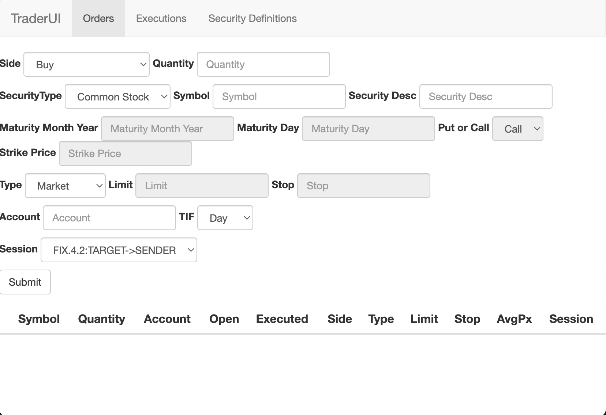

# UI Trader Example Client




## About
This repo contains an example of a quickfix Initiator service with a web UI that can interact with a quickfix Acceptor service and transmit common FIX messages back and forth. The messages are assembled and displayed in the UI in a way that will be familiar and informative to those wishing to explore basic quickfix capabilities. An acceptor to use as a local counterparty can be found in the [examples repo.](https://github.com/quickfixgo/examples)

## Building the Client
```sh
make build
```

## Running the Client
```sh
./bin/traderui
```
This will try to connect to a FIX acceptor on `localhost:5001` and expose the UI on `localhost:8080`.

## Licensing
This software is available under the QuickFIX Software License. Please see the [LICENSE](https://github.com/quickfixgo/traderui/blob/main/LICENSE) for the terms specified by the QuickFIX Software License.
